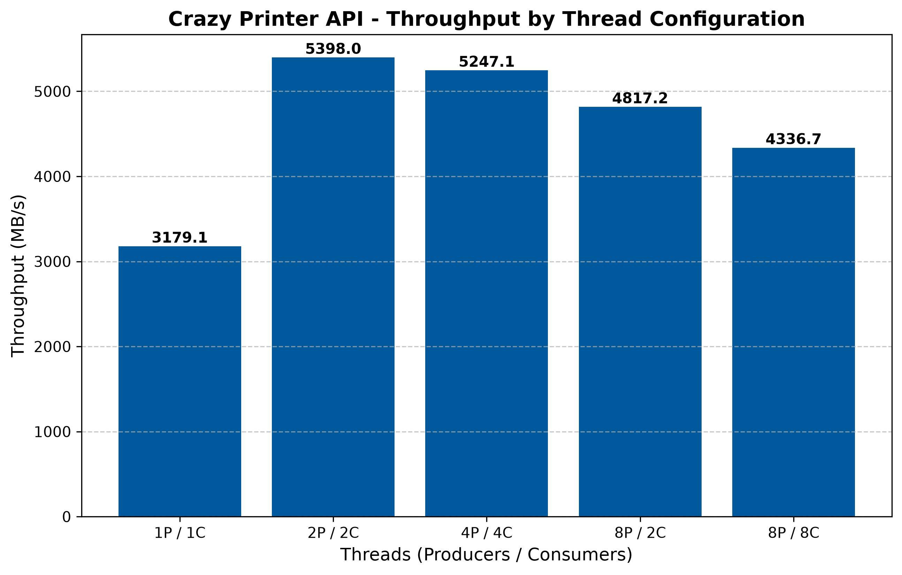

```
 ██████╗██████╗  █████╗ ███████╗██╗   ██╗
██╔════╝██╔══██╗██╔══██╗╚════██║╚██╗ ██╔╝
██║     ██████╔╝███████║    ██╔╝ ╚████╔╝ 
██║     ██╔══██╗██╔══██║   ██╔╝   ╚██╔╝  
╚██████╗██║  ██║██║  ██║   ██║     ██║   
 ╚═════╝╚═╝  ╚═╝╚═╝  ╚═╝   ╚═╝     ╚═╝  
     ██████╗ ██████╗ ██╗███╗   ██╗████████╗███████╗██████╗
     ██╔══██╗██╔══██╗██║████╗  ██║╚══██╔══╝██╔════╝██╔══██╗
     ██████╔╝██████╔╝██║██╔██╗ ██║   ██║   █████╗  ██████╔╝
     ██╔═══╝ ██╔══██╗██║██║╚██╗██║   ██║   ██╔══╝  ██╔══██╗
     ██║     ██║  ██║██║██║ ╚████║   ██║   ███████╗██║  ██║
     ╚═╝     ╚═╝  ╚═╝╚═╝╚═╝  ╚═══╝   ╚═╝   ╚══════╝╚═╝  ╚═╝
                       🖨️  A P I  🔥
```

> *"Because generating 2 Terabytes of fake logs shouldn't be boring."*

[](https://en.cppreference.com/w/cpp/20)
[](https://github.com/yhirose/cpp-httplib)
[](https://www.docker.com/)
[](https://cmake.org/)
[](LICENSE)
[-green.svg)]()

---

## What is this?

**Crazy Printer API** is a high-performance, asynchronous mock log generator written in C++20. It floods your filesystem with gigabytes of hilariously fake log files — on purpose.

It was built as a stress-testing torture device for [LogGrid](https://github.com/MikolajKos/LogGrid.git) — a distributed log processing system. If LogGrid can survive Crazy Printer, it can survive anything.

Sample output, for the uninitiated:

```
[2026-08-16 03:14:15] [WARN]  Printer tray 2 is philosophically empty.
[2026-08-16 03:14:16] [ERROR] Ink cartridge has achieved enlightenment and refuses to print.
[2026-08-16 03:14:17] [DEMONIC_POSSESSION] Firmware corrupted by ancient Sumerian curse. Please consult an exorcist.
[2026-08-16 03:14:18] [INFO]  Restarting printer... (attempt 666 of ∞)
```

---

## 📊 Benchmark

> Tested on RAM disk (`--tmpfs`) to isolate CPU performance from storage limits.
> **100 files × 100,000 lines ≈ 953 MB** per run.

**Run it yourself:**
```bash
# Start the server with RAM disk (no storage bottleneck)
docker run -d --rm \
  --name crazy-printer \
  -p 8080:8080 \
  -e OUTPUT_BASE_DIR=/data/logs/ \
  --tmpfs /data/logs \
  ghcr.io/mikolajkos/crazy-printer-api:v1.0.0

# Run benchmark
python3 -m venv .venv
source .venv/bin/activate
pip install -r benchmark/requirements.txt
python3 benchmark/run_benchmark.py
```



| Configuration | Throughput |
|---|---|
| 1P / 1C | 3,179 MB/s |
| **2P / 2C** | **5,398 MB/s** ⬅ peak |
| 4P / 4C | 5,247 MB/s |
| 8P / 2C | 4,817 MB/s |
| 8P / 8C | 4,337 MB/s |

**Key observations:**
- Peak throughput of **5.4 GB/s** saturates virtually any consumer SSD or HDD — at this point the bottleneck is the storage device, not the generator
- Sweet spot is **2P / 2C** — diminishing returns beyond that as CPU contention on string generation and RNG starts to dominate
- **8P / 8C** drops vs 2P / 2C — too many threads competing for the same CPU cores
- Even the slowest config (**1P / 1C** at 3.2 GB/s) exceeds the sequential write speed of most NVMe drives

> 💡 **Tuning tip:** for HDD use `consumerThreads: 1` to avoid head thrashing. For NVMe: `2P / 2C` or `4P / 4C`.

---

## Quick Start

Requires Docker and Docker Compose.

```bash
# Clone and start (Release build)
git clone https://github.com/MikolajKos/crazy-printer-api.git
cd crazy-printer-api
docker compose up -d --build

# Watch live logs
docker compose logs -f
```

```bash
# Start a print job
curl -X POST http://localhost:8080/api/printer/start \
  -H "Content-Type: application/json" \
  -d '{"fileCount": 100, "linesPerFile": 10000, "outputDir": "job_1", "producerThreads": 4, "consumerThreads": 4}'

# Check job status
curl http://localhost:8080/api/printer/status/1
```

---

## Architecture

Crazy Printer uses a **Producer-Consumer** pipeline with independent thread pools on both sides:

```
POST /api/printer/start
         │
         ▼
 GeneratorService::StartJob(config)
         │
         ├─► [Producer Pool]  →  generates text batches  →  [ThreadSafeQueue 256MB]
         │                                                          │
         └─► [Consumer Pool]  ←──────────────────────────  pops batches, writes to disk
                                    (Exclusive File Ownership — zero I/O locking)
```

### Key design decisions

- **Byte-based backpressure** — `ThreadSafeQueue` limits total in-flight data (default: 256MB), not element count. No OOM surprises.
- **Dual condition variables** — `m_cv_not_full` for producers, `m_cv_not_empty` for consumers. No thundering herd.
- **Exclusive file ownership** — each consumer thread owns its file exclusively. Zero file-level locking, zero disk thrashing.
- **Configurable thread counts** — tune `producerThreads` and `consumerThreads` independently for your hardware (HDD vs NVMe).
- **Dependency Injection** — `PrinterController` depends on `IGeneratorService`, not the concrete implementation. Testable by design.
- **Zero-alloc log generation** — `LogGenerator::GenerateLine` appends directly into a pre-reserved `std::string` batch. No per-line allocations at ~40M lines.
- **Atomic work distribution** — producers and consumers claim work via `fetch_add` on shared atomics. No scheduler, no mutex on the hot path.

---

## Stack

| Component  | Technology |
|---|---|
| Language   | C++20 |
| HTTP Server | [yhirose/cpp-httplib](https://github.com/yhirose/cpp-httplib) (vendored) |
| JSON       | [nlohmann/json](https://github.com/nlohmann/json) (vendored) |
| Logging    | [spdlog](https://github.com/gabime/spdlog) v1.15.3 — async, structured, color |
| Build      | CMake 3.25+ |
| Threads    | `std::jthread`, `std::mutex`, `std::condition_variable`, `std::atomic` |
| Container  | Docker + Docker Compose |

---

## API

### `POST /api/printer/start`

Starts an async log generation job. Returns immediately with a job ID — the printer does not wait for you.

**Request body:**
> **📝 Note:** `"outputDir"` is a sub-directory within the base logs directory (`/data/logs` by default, set via `OUTPUT_BASE_DIR` env). Providing `"outputDir": "job_1"` saves files to `/data/logs/job_1` on the mounted Docker volume. Leading slashes are stripped automatically.

```json
{
  "fileCount": 100,
  "linesPerFile": 10000,
  "outputDir": "job_1",
  "producerThreads": 4,
  "consumerThreads": 4
}
```

**Response `202 Accepted`:**
```json
{
  "jobId": 1,
  "status": "running"
}
```

---

### `GET /api/printer/status/:id`

Returns the current status of a job.

**Response `200 OK` — job in progress:**
```json
{
  "jobId": 1,
  "status": "running",
  "filesWritten": 42
}
```

**Response `200 OK` — job completed:**
```json
{
  "jobId": 1,
  "status": "done",
  "filesWritten": 100,
  "metrics": {
    "executionTimeSeconds": 12.345
  }
}
```

**Response `404 Not Found`:**
```json
{
  "error": "Job not found. Did the printer eat it?"
}
```

---

## Building

### Docker (recommended)

```bash
# Release
docker compose up -d --build

# Debug — full structured log output
BUILD_TYPE=Debug docker compose up -d --build

# Debug + AddressSanitizer
BUILD_TYPE=Debug SAN_TYPE=ASAN docker compose up -d --build

# Debug + ThreadSanitizer
BUILD_TYPE=Debug SAN_TYPE=TSAN docker compose up -d --build
```

### Local

```bash
cmake -S . -B build -DCMAKE_BUILD_TYPE=Release
cmake --build build
./build/CrazyPrinter
```

Requires a C++20-capable compiler (GCC 12+, Clang 14+) and internet access (CMake fetches spdlog via FetchContent).

---

## Project structure

```
crazy-printer-api/
├── external/
│   ├── httplib.h             # HTTP server (vendored)
│   └── json.hpp              # nlohmann/json v3.11.3 (vendored)
├── include/
│   ├── GeneratorService.hpp  # Interface + concrete impl + data structs (JobConfig, JobContext, Batch)
│   ├── LogGenerator.hpp      # Log line generator — zero-alloc append, thread_local RNG
│   ├── LoggerSetup.hpp       # spdlog async init, runtime level binding, ASCII welcome screen
│   ├── PrinterController.hpp # HTTP layer (forward decl only, no httplib include)
│   ├── ThreadPool.hpp        # Reusable jthread pool
│   └── ThreadSafeQueue.hpp   # Byte-limited producer-consumer queue (concept-constrained template)
└── src/
    ├── main.cpp              # Entry point — logger init, server start on 0.0.0.0:8080
    ├── GeneratorService.cpp  # Job lifecycle, producer & consumer tasks, I/O helpers
    ├── PrinterController.cpp # HTTP endpoints with structured request/response logging
    └── ThreadPool.cpp        # jthread pool impl
```

---

## Status

> ✅ Fully operational. The printer is on fire (intentionally).

- [x] Project structure & CMake setup (Release/Debug, ASAN/TSAN sanitizers)
- [x] `ThreadSafeQueue` — byte-based backpressure, dual CV, `markDone()` wakes both sides
- [x] `ThreadPool` with `std::jthread`
- [x] `LogGenerator` — zero-allocation line append, `thread_local` RNG & distributions, single timestamp per batch
- [x] `StartJob` — producers & consumers wired up, output dir prep, atomic file & line ownership
- [x] `PrinterController` — `POST /start` and `GET /status/:id` with latency logging
- [x] `main.cpp` — server starts on `0.0.0.0:8080`
- [x] Data race on `status` field fixed (`m_mutex` guards both read and write via `MarkAsFinished()`)
- [x] Producer deadlock fixed (`markDone()` now wakes blocked producers too)
- [x] Structured logging via `spdlog` — async, color, configurable level per build type
- [x] Configurable Docker build types — `BUILD_TYPE=Debug|Release`, `SAN_TYPE=ASAN|TSAN`
- [x] `filesWritten` counter in `GET /status` response (both `running` and `done`)
- [x] `metrics.executionTimeSeconds` in `GET /status` response when `done`

---

*Low on magenta. Always.*
